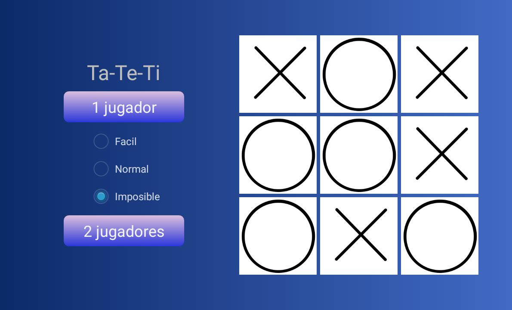

<h1 align="center">
   
  
   
  TaTeTi
   
</h1>

# Descripción
Juego diseñado en android studio usando archivos de recursos de todos los tipos y con el fin de maquetear una estetica prolija.
El juego cuenta con 3 dificultades de juego cada una con distinto algoritmo

Tecnologias usadas:
- Android Studio
- Java

# Capturas

### Juego

